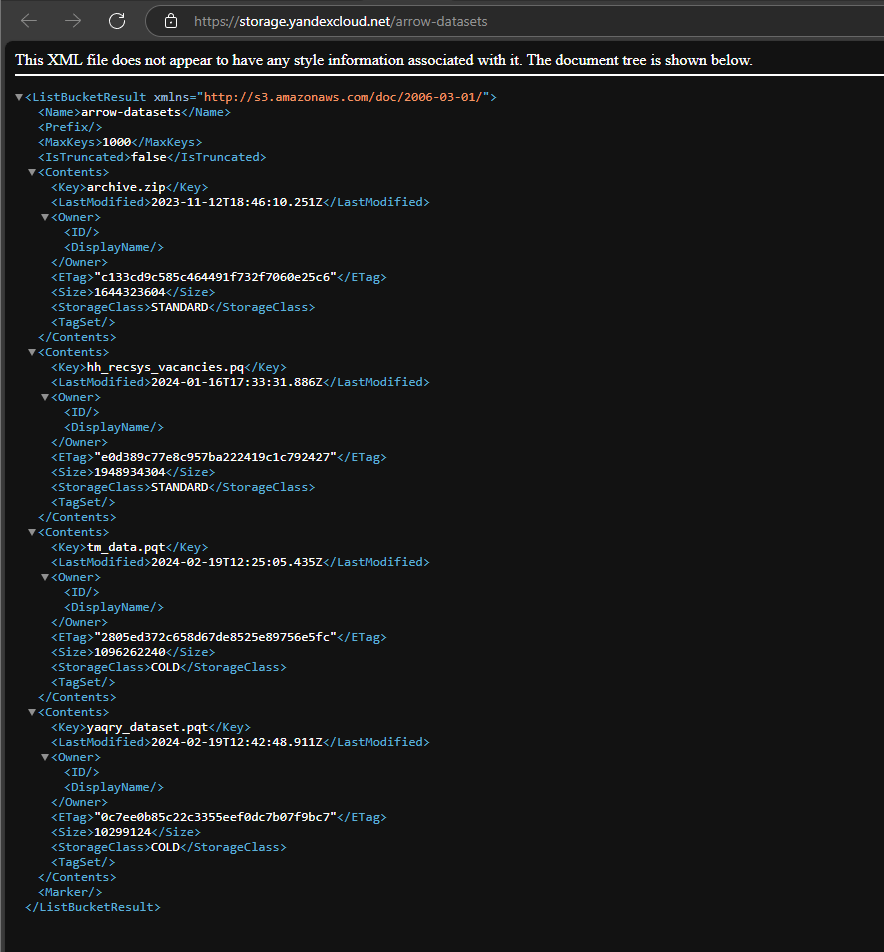
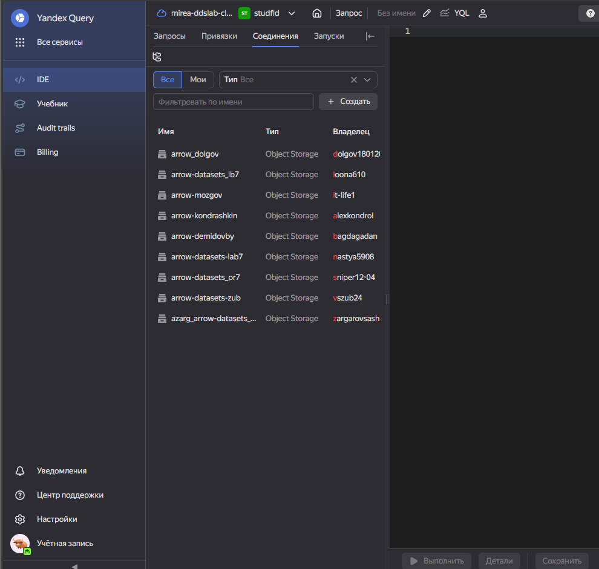
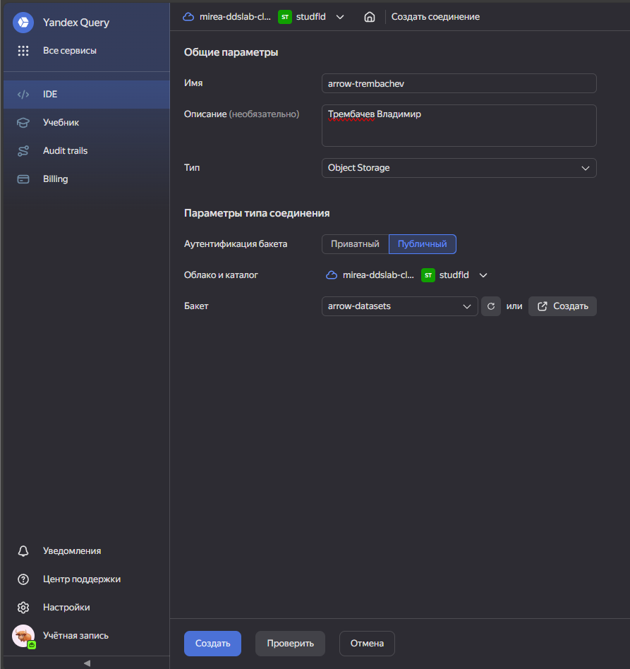
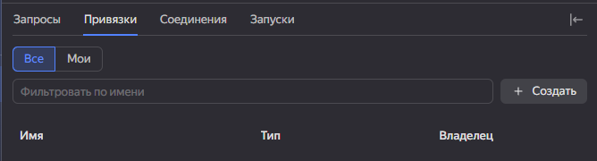
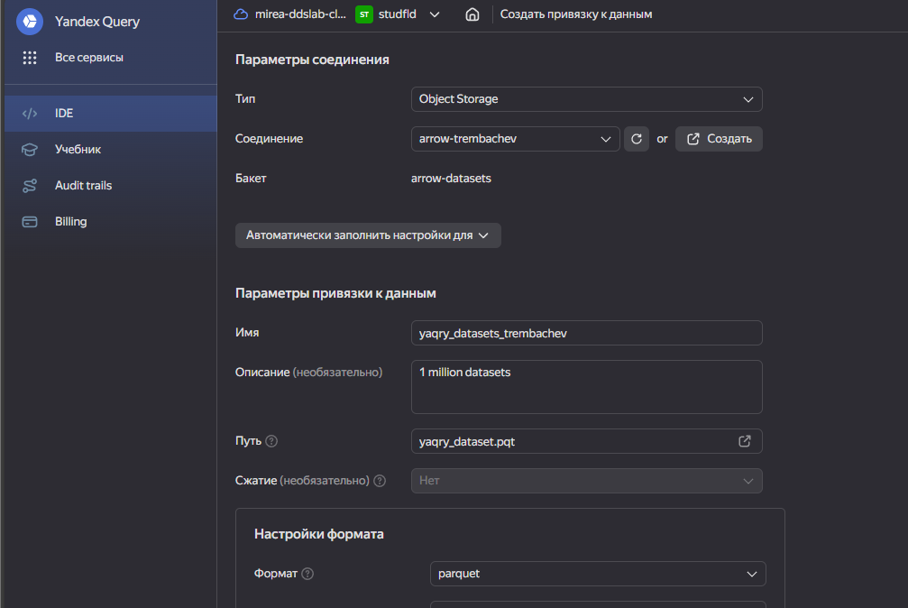
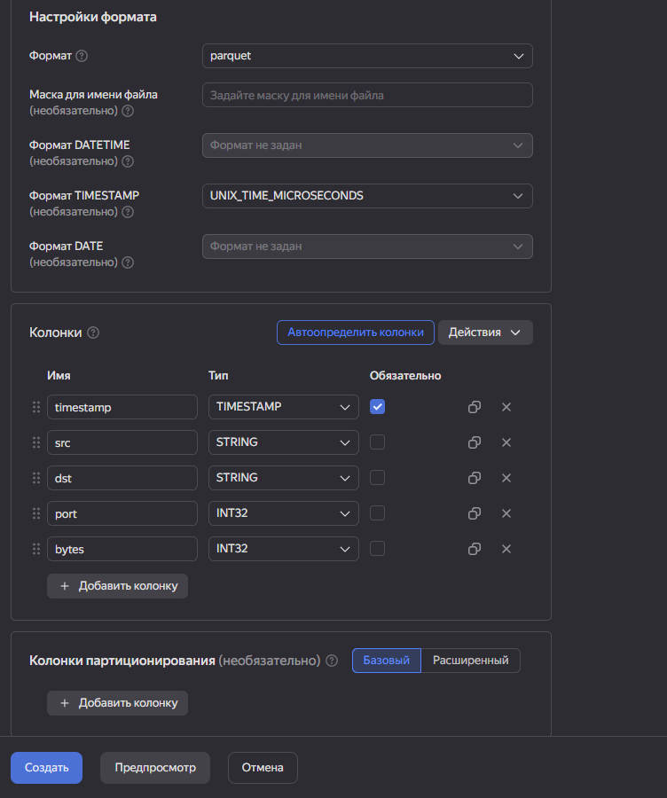
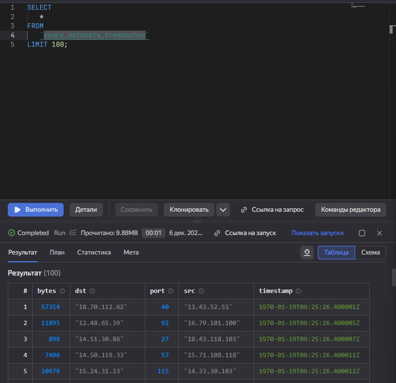
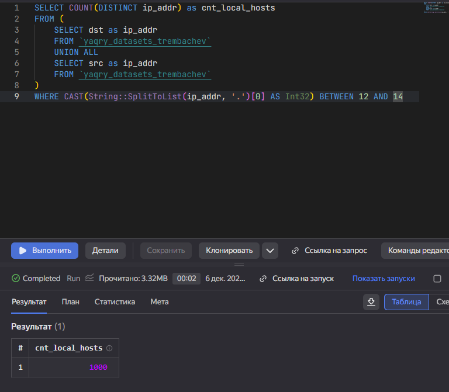
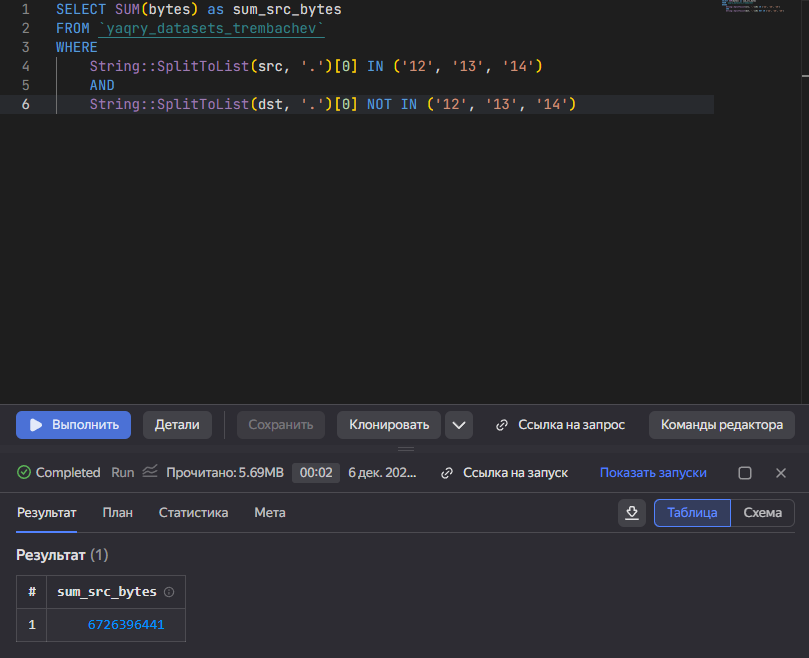
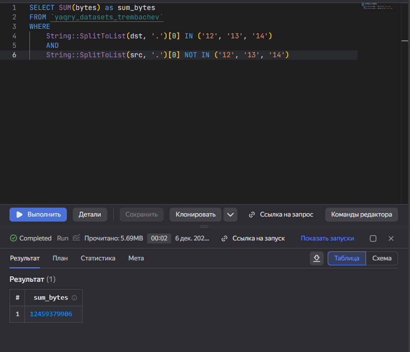

# Практическая работа 007
trembochev@yandex.ru

## Цель работы

1.  Изучить возможности технологии `Yandex Query` для анализа
    структурированных наборов данных
2.  Получить навыки построения аналитического пайплайна для анализа
    данных с помощью сервисов `Yandex Cloud`
3.  Закрепить практические навыки использования `SQL` для анализа данных
    сетевой активности в сегментированной корпоративной сети

## Исходные данные

1.  Программное обеспечение Windows 11
2.  данные сетевой активности в корпоративной сети компании XYZ.которых
    хранятся в `Yandex Object Storage`.

## Задание

Используя сервис `Yandex Query` настроить доступ к данным, хранящимся в
сервисе хранения данных `Yandex Object Storage`. При помощи
соответствующих SQL запросов ответить на вопросы.

## Ход работы

1.  Проверить доступность данных в Yandex Object Storag  
2.  Подключить бакет как источник данных для Yandex Query  
    2.1. Создать соединение для бакета в S3 хранилище  
    2.2. Заполняем поля с учетом допустимых символов  
    2.3. Создать привязку данных  
    2.4. Настройка привязки данных  
    2.5. Проверка правильности подключения  
3.  Анализ  
    3.1. Известно, что IP адреса внутренней сети начинаются с октетов,
    принадлежащих интервалу `[12-14]`. Определите количество хостов
    внутренней сети, представленных в датасете  
    3.2. Определите суммарный объем исходящего трафи  
    3.3. Определите суммарный объем входящего трафика  
4.  Оформить отчет в соответствии с шаблоном

### Шаг 1.

### 1. Проверить доступность данных в Yandex Object Storage

Файл находится по ссылке:
https://storage.yandexcloud.net/arrow-datasets/yaqry_dataset.pqt.
Перейдем к бакету в браузере, чтобы убедиться в его доступности:



### Шаг 2.

#### 2.1 Создать соединение для бакета в S3 хранилище



#### 2.2 Заполняем поля с учетом допустимых символов



#### 2.3 Создать привязку данных



#### 2.4 Настройка привязки данных

 Настроим формат согласно схеме:

    SCHEMA=(
    timestamp TIMESTAMP NOT NULL,
    src STRING,
    dst STRING,
    port INT32,
    bytes INT32
    )



#### 2.5 Проверка правильности подключения

``` sql
SELECT
   *
FROM
   `yaqry_datasets_trembachev`
LIMIT 100;
```

Получили вывод:



### Шаг 3.

#### 3.1 Известно, что IP адреса внутренней сети начинаются с октетов, принадлежащих интервалу \[12-14\]. Определите количество хостов внутренней сети, представленных в датасете

``` sql
SELECT COUNT(DISTINCT ip_addr) as cnt_local_hosts
FROM (
    SELECT dst as ip_addr
    FROM `yaqry_datasets_trembachev`
    UNION ALL
    SELECT src as ip_addr
    FROM `yaqry_datasets_trembachev`
)
WHERE CAST(String::SplitToList(ip_addr, '.')[0] AS Int32) BETWEEN 12 AND 14
```



Ровно 1000

#### 3.2. Определите суммарный объем исходящего трафика

``` sql
SELECT SUM(bytes) as sum_src_bytes
FROM `yaqry_datasets_trembachev`
WHERE 
    String::SplitToList(src, '.')[0] IN ('12', '13', '14')
    AND
    String::SplitToList(dst, '.')[0] NOT IN ('12', '13', '14')
```



#### 3.3. Определите суммарный объем входящего трафика

Задача идентичная предыдущей, нужно лишь поменять местами `dst` и `src`

``` sql
SELECT SUM(bytes) as sum_bytes
FROM `yaqry_datasets_trembachev`
WHERE 
    String::SplitToList(dst, '.')[0] IN ('12', '13', '14')
    AND
    String::SplitToList(src, '.')[0] NOT IN ('12', '13', '14')
```



### Шаг 4

Отчёт написан и оформлен

## Оценка результатов

Задача решена с использованием сервис `Yandex Query`.Я научился
использовать этот инструмент для анализа данные сетевой активности в
корпоративной сети компании XYZ.

## Вывод

В данной работе я ия познакомился с сервисами Yandex Cloud, изучил
возможности технологии Yandex Query для анализа структурированных
наборов данных, узнал о хранилище S3
